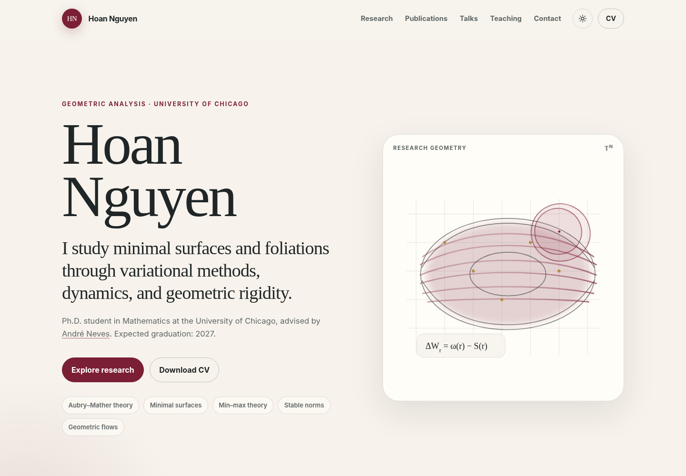

# Hoan Nguyen — Academic Website

A polished, responsive academic website built as a zero-dependency static site for GitHub Pages.


## Included

- Responsive one-page layout
- Light and dark themes
- Research, publications, invited talks, education, teaching, awards, and contact sections
- Local copies of the CV and three current research manuscripts
- Accessible navigation and reduced-motion support
- SEO metadata, social preview image, favicon, web manifest, and custom 404 page

## Publish with GitHub Pages

1. Create a public repository named `nthehoan.github.io`.
2. Upload the **contents** of this folder to the repository root.
3. In the repository, open **Settings → Pages**.
4. Choose **Deploy from a branch**, then select `main` and `/ (root)`.
5. Your site will appear at `https://nthehoan.github.io/`.
6. The sitemap and metadata are already configured for `https://nthehoan.github.io/`.

The site is plain HTML/CSS/JavaScript, so no build command or package installation is required.

## Local preview

From this folder, run:

```bash
python3 -m http.server 8000
```

Then open `http://localhost:8000`.

## Main files

- `index.html` — all website content
- `styles.css` — layout and visual design
- `script.js` — theme, mobile navigation, reveal animations, and copy-email action
- `assets/` — CV, papers, favicon, and social preview image

## Updating content

Most text can be edited directly in `index.html`. Research PDFs are in `assets/papers/`. Keep filenames stable or update the corresponding links in `index.html`.

## Optional custom domain

After adding a domain in GitHub Pages settings, create a `CNAME` file in the repository root containing only the domain name.
